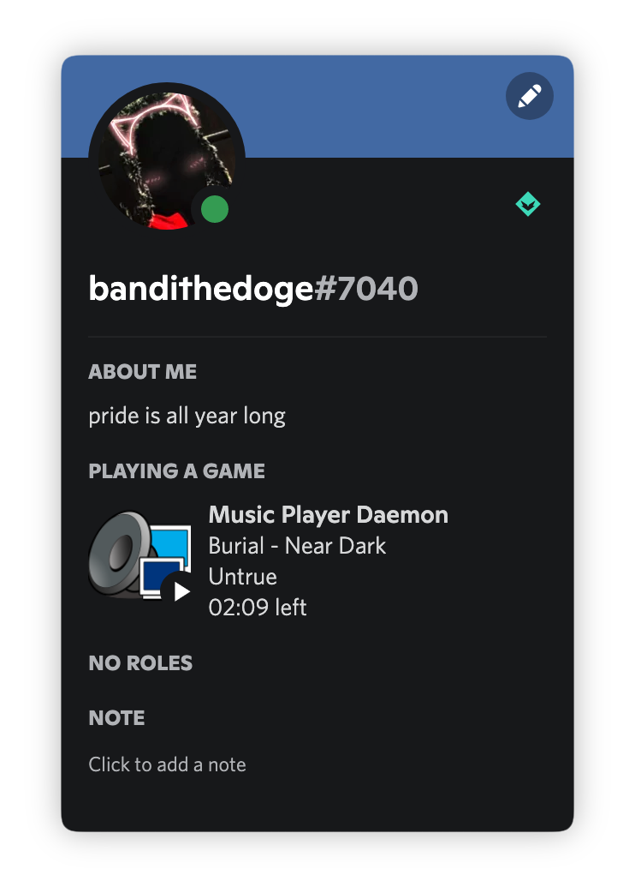

# mpdcord



```console
usage: mpdcord [-h|--help] [-c|--config "<value>"] [-v|--verbose]

               Discord Rich Presence for MPD written in Go

Arguments:

  -h  --help     Print help information
  -c  --config   Specify non-standard config path. Default:
                 $XDG_CONFIG_HOME/mpdcord.toml
  -v  --verbose  Output additional information, useful for debugging. Default:
                 false
```

## Installation

You can install `mpdcord` on any distro/OS by building it yourself with [Go](https://go.dev/doc/install). This will install the binary to `$GOPATH/bin/mpdcord` (defaults to `~/go/bin/mpdcord`), so make sure it's in your `$PATH`.

```bash
# latest stable
go install github.com/bandithedoge/mpdcord

# latest unstable
go install github.com/bandithedoge/mpdcord@latest
```

## Configuration

Everything is configured in a TOML file located at `$XDG_CONFIG_HOME/mpdcord.toml` (defaults to `~/.config/mpdcord.toml`). Here is an example configuration populated with default values:

```toml
# Note: keys are not case-sensitive.

# Discord API application ID, use this to customize title and images
ID = 922175995828654100
# Where to connect to MPD
Address = "localhost:6600"
# How to connect to MPD
Network = "tcp"
# Optional MPD password
Password = ""

# Formatting is done using strings with keys wrapped in curly braces, for example: "{title}"
# For all possible keys refer to:
#   - https://mpd.readthedocs.io/en/latest/protocol.html#tags
#   - https://mpd.readthedocs.io/en/latest/protocol.html#command-status
#   - https://mpd.readthedocs.io/en/latest/protocol.html#command-stats

[Format]
  # First line
  Details = "{title}"
  # Second line
  State = "{artist}"
  # Text to display above the large image
  LargeText = "{album}"
  # Text to display above the small image
  SmallText = "{state}"
  # Time display mode:
  #   - true: "XX:XX left"
  #   - false: "XX:XX elapsed"
  Remaining = false
  # What to do when paused
  #   - true: Display nothing
  #   - false: Act normally (show all the metadata and a "pause" icon)
  PlayingOnly = false
```

> Configuration keys and their default values are defined in [`defaults.go`](defaults.go)

## TODO

- [ ] Don't reconnect to Discord at every status change
- [ ] Figure out dynamically changing album covers (will definitely require a custom app ID)
